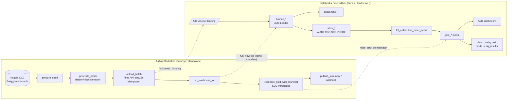

# food-delivery-databricks-lakehouse

[](https://github.com/rohit91jacob/food-delivery-databricks-lakehouse/actions/workflows/ci.yml)
[](https://github.com/rohit91jacob/food-delivery-databricks-lakehouse/actions/workflows/refresh.yml)
[](LICENSE)


An end-to-end data platform for a Swiggy/Zomato-style **food-delivery** business, built on **Databricks Free
Edition** (Unity Catalog, Auto Loader, Lakeflow Declarative Pipelines with AUTO CDC/SCD2, Lakeflow Jobs, AI/BI
dashboard), all declared as a **Databricks Asset Bundle** and orchestrated by **Apache Airflow 3**.

A seeded, deterministic simulator turns a **CC0 Kaggle restaurant dataset** into a realistic daily feed: orders,
lifecycle events, rider dispatch and GPS pings, payments, refunds, ratings, promotions, surge and weather. It
writes a **ground-truth manifest** alongside the data, and the platform proves that every gold metric matches
it **exactly**, every day.

> **Status.** The pipeline is deployed to a Databricks Free Edition workspace (dev target). A **nightly GitHub
> Actions refresh** adds one business date at a time: it generates the day, uploads it, runs the job, and
> reconciles gold with the generator manifest. For every date processed so far, gold matches the manifest
> **exactly**: all 26 metrics x 5 cities, checked both by the job's DQ gate and by an independent reconciliation.
> See [Live verification](#live-verification-databricks-free-edition) and
> [Scheduling & freshness](#scheduling--freshness).

---

## Architecture



| Component | Where | What it does |
|---|---|---|
| Seed | `seed/`, `src/fooddelivery/seeding.py`, `generator/seed.py` | The normalised CC0 Kaggle seed (8,673 restaurants) is committed and checksum-verified; `FD_SEED_SOURCE=kaggle` rebuilds it from `abhijitdahatonde/swiggy-restuarant-dataset` |
| Simulator | `src/fooddelivery/generator/` | 14 raw feeds plus a manifest per business date. Byte-for-byte reproducible; injects duplicates and corrupt rows on purpose |
| Landing sync | `src/fooddelivery/landing/uploader.py` | Files API upload to a UC volume. Skips unchanged files, prunes stale versions, commit-marker index |
| Lakeflow pipeline | `src/fooddelivery_pipeline/transformations/` | Bronze (Auto Loader) → silver (expectations, quarantine, AUTO CDC SCD1/SCD2) → gold (12 materialized views) |
| Shared logic | `src/fooddelivery/transforms/` | Schemas, rules and transformations, importable by the pipeline because its `root_path` is `src/` (on `sys.path`) |
| DQ gate | `src/fooddelivery/quality/` | 13 checks (`fd-dq` job task → `dq_results`) plus independent Airflow reconciliation SQL |
| Bundle (IaC) | `databricks.yml`, `resources/*.yml` | Schema, volume, pipeline, job, dashboard; `dev`/`prod` targets |
| Scheduled refresh | `.github/workflows/refresh.yml`, `src/fooddelivery/refresh.py` | Nightly hosted run: credential check → next date → generate → upload → job → reconcile, opening an issue on failure |
| Orchestration (self-hosted) | `airflow/` | DAG, image, docker-compose (LocalExecutor) |
| Offline emulator | `src/fooddelivery/local/` | Runs the **unchanged** pipeline files on local Spark with shims ([ADR 0004](docs/adr/0004-local-pipeline-emulator.md)) |

## Tech stack (pinned)

| Area | Version |
|---|---|
| Python | 3.12 (matches Databricks serverless environment 5) |
| Databricks CLI / bundles | 1.19.0 (checksum-verified in CI) |
| Lakeflow Declarative Pipelines | `from pyspark import pipelines as dp`, serverless, `channel: CURRENT` |
| Serverless jobs environment | `environment_version: "5"` |
| Apache Airflow | 3.3.2 + `apache-airflow-providers-databricks` 7.20.0 (the version pinned by the official 3.3.2 constraints) |
| databricks-sdk | 0.148.0 |
| kaggle | 2.2.4 (`KGAT_` access tokens) |
| Local Spark / Delta (tests, emulator) | pyspark 4.0.1 / delta-spark 4.0.1 (Java 17+) |
| Tooling | uv (lockfile `uv.lock`), ruff 0.16.10, pytest 9.1.1 |

## Data sources

| Source | Licence | Refresh |
|---|---|---|
| Kaggle [`abhijitdahatonde/swiggy-restuarant-dataset`](https://www.kaggle.com/datasets/abhijitdahatonde/swiggy-restuarant-dataset) (`swiggy.csv`): restaurant names, areas, cuisines, price-for-two, ratings, listed delivery time | **CC0-1.0** (public domain). The raw CSV is not committed; the normalised seed derived from it is (`seed/`, see [seed/README.md](seed/README.md)) | Static (the dataset's `expectedUpdateFrequency` is "never"). The committed seed keeps simulations reproducible; `FD_SEED_SOURCE=kaggle fd seed --force` rebuilds it |
| Synthetic generator (this repo): customers, menus, orders, events, riders, shifts, GPS, payments, refunds, ratings, promotions, weather/traffic/surge | MIT (code) | One business date per night (`refresh.yml`, or Airflow `@daily` in Asia/Kolkata); any date can be regenerated |
| City-centre coordinates | Public knowledge | Static |

Why this dataset, and which ones were rejected: [ADR 0006](docs/adr/0006-kaggle-seed.md).

## Data model

Layers: landing (volume) → `bronze_*` → `quarantine_*` / `silver_*` → `fct_*` → `gold_*`, plus `dq_results`. They are spread over three
schemas (`fooddelivery`, `fooddelivery_gold`, `fooddelivery_ops`) to stay under Free Edition's 100-tables-per-schema limit.
All are reconciled on **`business_date`** (order placement date, IST).

| Table | Grain / keys |
|---|---|
| `silver_restaurants`, `silver_menu_items` | SCD2 on `restaurant_id` / `item_id` (`__START_AT`, `__END_AT`) |
| `silver_orders`, `silver_order_items`, `silver_order_events`, … | SCD1 on natural keys (dedupe) |
| `fct_orders` | `order_id`, with point-in-time restaurant attributes and SLA durations |
| `gold_daily_kpis` | `business_date, city`; reconciles 1:1 with the manifest |
| `gold_delivery_sla_hourly`, `gold_restaurant_daily`, `gold_rider_daily`, `gold_customer_cohorts`, `gold_customer_ltv`, `gold_cancellations_daily`, `gold_refunds_daily`, `gold_menu_popularity_weekly`, `gold_surge_promo_daily` | see the data dictionary |

Full column-level detail is in [docs/data_dictionary.md](docs/data_dictionary.md), and metric definitions are in
[docs/metrics.md](docs/metrics.md).

## Quickstart

### Prerequisites
- [uv](https://docs.astral.sh/uv/), Python 3.12 and Java 17+ (Java is only needed for the Spark tests and `fd local-run`)
- No Kaggle account: the seed is committed. A Kaggle token is only needed for `FD_SEED_SOURCE=kaggle`
- For deployment: a Databricks Free Edition workspace, a personal access token, and the Databricks CLI ≥ 1.19
- Optional: Docker for the compose deployment

### 1. Local run, no Databricks needed (verified locally)

```bash
uv sync --group dev --group spark --extra seed --extra databricks
export FD_DATA_DIR=$HOME/fd-work/data

uv run fd seed                                    # unpack the committed seed + verify its sha256
uv run fd generate --date 2026-09-01 --days 3     # landing files + manifest
uv run fd local-run                               # real pipeline sources on local Spark + the 13 DQ checks
```

`fd seed` prints the seed metadata, for example `"restaurants": 8673`, `"license": "CC0-1.0"`, and a sha256 that
is stable across runs. `fd generate` prints per-day file and row counts; with defaults, 2026-09-01 has
`"orders_placed": 2951`. `fd local-run` prints row counts for every dataset and the check results per date. The
3-day default run gave:

```text
bronze_orders 9540 -> silver_orders 9495 (+18 quarantined, 27 duplicates removed) -> fct_orders 9495
fct_order_items 17506, gold_daily_kpis 15 (5 cities x 3 days)
2026-09-01 / 02 / 03: all 13 checks ok, dq_failed_errors = 0
```

The same seed, config and date always produce identical files. Rerunning `fd generate` for a date rewrites the
same bytes.

### 2. Deploy to Databricks Free Edition (verified against a real workspace, dev target)

```bash
export DATABRICKS_HOST=https://<workspace>.cloud.databricks.com
export DATABRICKS_TOKEN=<personal-access-token>
databricks bundle validate -t dev
databricks bundle deploy -t dev
uv run python scripts/bundle_env.py dev     # prints FD_SCHEMA / FD_DATABRICKS_JOB_NAME for the dev target
uv run fd upload --date 2026-09-01 --days 3
databricks bundle run fooddelivery_daily -t dev --params run_date=2026-09-01
```

### 3. Airflow

**Standalone, no Docker (verified locally):** this was run with the same settings as `make standalone`. The
API server, scheduler, triggerer and DAG processor all reported healthy, and the DAG registered with no import
errors. `prepare_seed` (the real Kaggle download) and `generate_batch` were also run with `airflow tasks test`.

```bash
uv sync --group dev --group airflow --extra seed --extra databricks
make standalone            # AIRFLOW__API__PORT=28880, DAGs from airflow/dags
```

**Docker Compose (verified in CI only: build, healthy services, DAG registered):**

```bash
cp airflow/.env.example airflow/.env       # set AIRFLOW_CONN_DATABRICKS_DEFAULT, FD_SCHEMA, FD_DATABRICKS_JOB_NAME
docker compose -f airflow/docker-compose.yaml up -d --build --wait
# UI: http://localhost:8080 (airflow / airflow)
```

A manually triggered run (or `airflow tasks test <dag> <task> <logical_date>`) processes the last *complete*
IST day before the logical date. For example, logical date `2026-09-02T00:00:00+05:30` processes business date
2026-09-01.

## Configuration

Every variable is in [`.env.example`](.env.example) (CLI and tests) and [`airflow/.env.example`](airflow/.env.example) (compose).

| Variable | Default | Purpose |
|---|---|---|
| `FD_SEED` | `42` | RNG seed (same seed + date ⇒ identical bytes) |
| `FD_START_DATE` | `2026-09-01` | Day 0 (full dimension snapshot) and DAG start |
| `FD_CITIES` | `Bangalore,Mumbai,Delhi,Hyderabad,Pune` | Any of the 9 seed cities |
| `FD_RESTAURANTS_PER_CITY` | `120` | Restaurants sampled from the seed per city |
| `FD_BASE_ORDERS_PER_CITY` | `600` | Daily orders before weekday/festival/weather/growth effects |
| `FD_INITIAL_CUSTOMERS_PER_CITY` | `4000` | Customer base on day 0 (grows about 0.45%/day) |
| `FD_RIDERS_PER_100_ORDERS` | `18` | Fleet size relative to demand |
| `FD_GPS_PING_SECONDS` | `120` | GPS ping interval while on an order |
| `FD_DUPLICATE_RATE` / `FD_INVALID_RATE` | `0.003` / `0.002` | Injected duplicates / corrupt orders |
| `FD_SEED_SOURCE` | `committed` | `committed` (the repo's CC0 seed), `kaggle` (rebuild from Kaggle) or `synthetic` |
| `FD_COMMITTED_SEED` | `seed/restaurants.jsonl.gz` | Location of the committed seed (the Airflow image sets it) |
| `FD_KAGGLE_TOKEN_FILE` | empty | File holding a `KGAT_` token (containers) |
| `FD_DATA_DIR` | `data` | Local landing zone, seed and downloads |
| `FD_CATALOG` / `FD_SCHEMA` / `FD_VOLUME` | `workspace` / `fooddelivery` / `landing` | UC target; dev schema is `dev_<user>_fooddelivery` |
| `FD_GOLD_SCHEMA` | `<FD_SCHEMA>_gold` | Schema of `fct_*` / `gold_*` (the reconciliation target) |
| `FD_DATABRICKS_JOB_NAME` | `fooddelivery_daily` | dev: `[dev <user>] fooddelivery_daily` |
| `FD_SQL_WAREHOUSE_NAME` | `Serverless Starter Warehouse` | Warehouse for the Airflow reconciliation |
| `FD_DATABRICKS_CONN_ID` | `databricks_default` | Airflow connection id |
| `FD_ALERT_WEBHOOK_URL` | empty | Slack-compatible webhook for success/failure |
| `FD_LOG_LEVEL` / `FD_LOG_FORMAT` | `INFO` / `json` | Structured logging |
| `FD_SPARK_MASTER` / `FD_SPARK_DRIVER_MEMORY` / `FD_SPARK_JARS` | `local[4]` / `2g` / empty | Local Spark; `FD_SPARK_JARS` takes offline Delta jars |

### GitHub Actions configuration

Set these in **Settings → Secrets and variables → Actions**. None of them are needed for CI; the Databricks jobs
skip cleanly without them.

| Kind | Name | Used by | Purpose |
|---|---|---|---|
| Variable (or secret) | `DATABRICKS_HOST` | refresh, deploy | Workspace URL |
| Variable | `DATABRICKS_CLIENT_ID` | refresh (deploy if opted in) | Service principal application ID; enables OAuth M2M, or GitHub OIDC if no secret is set |
| Secret | `DATABRICKS_CLIENT_SECRET` | refresh (deploy if opted in) | Service principal OAuth secret (≤ 730 days) |
| Variable | `DATABRICKS_CLIENT_SECRET_EXPIRES` | refresh | `YYYY-MM-DD`, so the credential check can warn before the secret expires |
| Secret | `DATABRICKS_TOKEN` | deploy; refresh until the service principal exists | Personal access token (≤ 730 days in this workspace) |
| Variable | `DATABRICKS_TOKEN_ID` | refresh | Pins which PAT the expiry check judges |
| Variable | `FD_DEPLOY_AUTH` | deploy | `service-principal` to deploy as the service principal (an advanced migration; see the auth guide) |
| Variable | `FD_CREDENTIAL_WARN_DAYS` | refresh | Warning window, default `14` |
| Variables | `FD_CATALOG`, `FD_SCHEMA`, `FD_GOLD_SCHEMA`, `FD_DATABRICKS_JOB_NAME` | refresh | Target overrides; the defaults are this repo's dev deployment |

Step-by-step setup and renewal: **[docs/databricks_auth.md](docs/databricks_auth.md)**.

## Testing & CI

```bash
uv run ruff check . && uv run ruff format --check .
uv run pytest -m "not spark and not airflow"     # 49 tests: generator, seed, config, uploader, SQL, bundle schema, refresh/auth logic
uv run pytest -m spark                            # 10 tests: SCD semantics + pipeline end-to-end (emulator + DQ)
AIRFLOW__CORE__LOAD_EXAMPLES=false uv run pytest -m airflow   # 3 tests: DAG integrity
```

All of these ran locally (WSL, Java 21).

| Workflow / job | What it checks |
|---|---|
| `ci.yml` / lint | ruff lint + format |
| `ci.yml` / unit | Unit tests, plus every bundle YAML validated against `databricks bundle schema` from the pinned CLI |
| `ci.yml` / spark | Java 17: SCD1/SCD2 semantics; the real pipeline sources emulated end to end; every error-severity DQ check per day; exact dedupe/quarantine counts; SCD2 point-in-time pricing; the Airflow reconciliation SQL passing, then catching a 1-paisa tamper; idempotent rerun |
| `ci.yml` / airflow | DagBag import, task graph, retries, `depends_on_past`, deferrable trigger |
| `ci.yml` / compose | `docker compose config`, image build, `up --wait` (all services healthy), DAG registered without import errors |
| `deploy.yml` | `bundle validate` + `deploy` (dev on PRs, prod on `main`). Skipped cleanly until a host and credential are configured |
| `refresh.yml` | Nightly (01:00 UTC) and manual: credential health → next business date → generate → upload → job → reconciliation, with an issue on failure |
| `keepalive.yml` | Monthly: re-enables the scheduled workflows so GitHub's 60-day inactivity rule never switches them off |

Dependabot covers Actions, uv and Docker. pre-commit runs ruff and basic hygiene hooks.

## Operations

- **Scheduling:** the hosted nightly refresh (`refresh.yml`, below). Alternatively, self-host Airflow
  `food_delivery_daily` (00:00 IST, `catchup=True`, `max_active_runs=1`; Free Edition allows one active
  pipeline update). Run one or the other against a target, never both. The bundle job's own schedule ships
  paused.
- **Backfill/reprocessing:** `airflow backfill create --dag-id food_delivery_daily --from-date … --to-date …`.
  Every step is idempotent per date ([ADR 0002](docs/adr/0002-idempotency.md)). After a generator change, bump
  `GENERATOR_VERSION` and full-refresh the pipeline.
- **Data quality:** expectations (warn/drop/fail plus quarantine tables), the `fd-dq` gate writing `dq_results`,
  and independent reconciliation from Airflow ([ADR 0005](docs/adr/0005-layered-data-quality.md)).
- **Monitoring/alerts:** pipeline and job failure emails to the deployer, the Airflow `on_failure_callback`
  webhook, `dq_results` history, and the AI/BI dashboard.
- **Credentials:** see [Scheduling & freshness](#scheduling--freshness) and [docs/databricks_auth.md](docs/databricks_auth.md).
- Runbook (scheduled refresh failures, backfills, DQ triage, quota exhaustion, credential rotation, dev reset):
  [docs/runbook.md](docs/runbook.md).

## Scheduling & freshness

| What | Cadence | How |
|---|---|---|
| New data | **Nightly**, 01:00 UTC (06:30 IST) | `refresh.yml` processes the next business date: the newest date in `gold_daily_kpis`, plus one. It stops when the simulated calendar reaches today (IST). |
| Re-processing a date | On demand | **Actions → Scheduled refresh → Run workflow** with `business_date`. Every step is idempotent. |
| Code | On every push to `main` | CI, then `deploy.yml` (prod target) |
| Dependencies | Weekly | Dependabot PRs, each tested by CI |
| Schedule keep-alive | Monthly | `keepalive.yml` re-enables scheduled workflows through the API, with no commits |

**Cost:** one date uses about 16 minutes of Free Edition serverless compute (about 9 for the pipeline refresh). If
the daily fair-use quota runs out, compute stops until the next day, and the next nightly run simply retries the
same date. To use less, change the cron, e.g. `0 1 * * 1,4`.

**Credentials, and how they stay valid:**

| Credential | Lifetime | Who renews it, and when |
|---|---|---|
| `GITHUB_TOKEN` (issues, keep-alive) | per run | GitHub, automatically |
| Kaggle token | not needed | the CC0 seed is committed |
| Service principal OAuth secret (recommended for the refresh) | ≤ 730 days | You, every two years; an issue warns 14 days ahead |
| PAT (`DATABRICKS_TOKEN`, deploys) | ≤ 730 days | You, every two years; the refresh's check also warns if it's the active credential |
| GitHub OIDC federation (no secret at all) | never | Supported by the workflow, but it needs account-level APIs, which Free Edition lacks |

Before touching data, every refresh runs a **credential health** job. It authenticates, reads the remaining lifetime,
and fails within 14 days of expiry. It then opens (or comments on) a *"Databricks credential needs attention"*
issue. Any other failure opens *"Scheduled refresh failed"*. GitHub also emails you about failed scheduled runs.
Details: [ADR 0007](docs/adr/0007-unattended-auth.md).

## Project structure

```text
.
├── databricks.yml                 # bundle: variables, dev/prod targets
├── resources/                     # storage.yml, pipeline.yml, job.yml, dashboard.yml
├── dashboards/food_delivery_ops.lvdash.json
├── src/
│   ├── fooddelivery/
│   │   ├── generator/             # world model, simulator, writer, seed normalisation
│   │   ├── transforms/            # schemas, silver specs/rules, gold marts (shared with the pipeline)
│   │   ├── quality/               # DQ check catalog, fd-dq runner, Airflow reconciliation SQL
│   │   ├── landing/uploader.py    # Files API sync
│   │   ├── local/                 # pipeline emulator + local AUTO CDC (SCD1/SCD2)
│   │   ├── refresh.py             # scheduled refresh: auth selection, credential health, job + SQL helpers
│   │   ├── seeding.py, config.py, logs.py, cli.py
│   └── fooddelivery_pipeline/transformations/   # bronze_ingest.py, silver_conform.py, gold_marts.py
├── airflow/                       # dags/, Dockerfile, docker-compose.yaml, .env.example
├── tests/                         # unit/, spark/, airflow/
├── seed/                          # committed CC0 restaurant seed + checksum + attribution
├── docs/                          # databricks_auth.md, data_dictionary.md, metrics.md, runbook.md, adr/
├── scripts/                       # bundle_env.py, gh_issue.sh
├── .github/                       # workflows/{ci,deploy,refresh,keepalive}.yml, dependabot.yml
├── Makefile, pyproject.toml, uv.lock, .env.example, .pre-commit-config.yaml
```

## Design rationale

Four constraints shaped the design. The target is **Databricks Free Edition**: serverless-only compute under a daily
fair-use quota, restricted outbound internet, one active pipeline update at a time, 100 tables per schema, managed
storage only and no account-level APIs ([ADR 0001](docs/adr/0001-free-edition-constraints.md)). Correctness has to
be **provable**, so a real CC0 seed drives a deterministic simulator whose manifest is the ground truth. The platform
has to **run unattended** on free GitHub-hosted runners, with nobody there to rerun a step or renew a token. And
**CI has no workspace**: `ci.yml` uses no Databricks credentials, so the pipeline must be verifiable offline.

### Architecture decisions

| Decision | Why | Alternatives considered | Trade-off accepted |
|---|---|---|---|
| **Generate outside, ingest inside** ([ADR 0001](docs/adr/0001-free-edition-constraints.md)) | Serverless egress is restricted, so the orchestrator generates each date and pushes it through the Files API into a managed volume (`src/fooddelivery/landing/uploader.py`). The workspace never calls the internet, and the orchestrator keeps its own copy of the manifest for the independent reconciliation | Downloading the seed and generating inside a serverless job; an external S3/ADLS landing location | The orchestrator needs the Databricks credential and local disk, and every date costs an upload hop (a rerun moves 0 bytes) |
| **Three schemas, prefixed layers**: `<schema>` (landing, bronze, quarantine, silver), `<schema>_gold`, `<schema>_ops` | Free Edition allows 100 tables per schema, and every pipeline dataset also owns a hidden `__materialization_*` table, so the bronze/silver schema alone holds about 70 tables. Publishing gold to its own schema from the same pipeline, and `dq_results` to a third, keeps each schema well under the cap | One schema for every layer; a quarantine table for every feed; a workspace per environment | Only orders, order_events, payments and refunds keep quarantine tables; other feeds' rejects are only counted in expectation metrics. Dev and prod share one workspace, separated by the bundle's dev-mode prefix |
| **AUTO CDC everywhere in silver, SCD2 only where history is consumed** ([ADR 0003](docs/adr/0003-auto-cdc-and-scd2.md)) | One primitive covers dedupe, upserts, deletes and history. CDC feeds sequence by `updated_at` and treat `op = 'DELETE'` as a delete; fact feeds sequence by `_ingested_at`. Restaurants and menu items keep SCD2 because gold joins commission rates and menu prices point-in-time (`as_of` in `src/fooddelivery/transforms/gold.py`) | Hand-written `MERGE INTO` per table; SCD2 on every dimension; daily dimension snapshots | Customers, riders and promotions keep only their current state; untracked changes (the weekly rating refresh) update the current version in place; as-of range joins cost more than key joins |
| **Idempotent by construction, partitioned on `business_date`** ([ADR 0002](docs/adr/0002-idempotency.md)) | Randomness comes from `sha256(seed, scope, business_date)`, so a date regenerates byte-identically. Versioned file names, an upload that skips files by sha256 and writes its index last as a commit marker, Auto Loader's file tracking and key-based upserts make every layer safe to rerun. Events after midnight stay with their order's date, so dates are self-contained and replayable | Partitioning by event or ingestion time; truncate-and-reload per date; dedupe in gold | A generator change needs a `GENERATOR_VERSION` bump and a full pipeline refresh, because bronze is append-only. `FD_START_DATE` has to run first and dates in order, since later dates carry CDC changes only |
| **Exact reconciliation, not tolerances** | The simulator writes a ground-truth manifest per date and city. Money is integer paise in the generator and DECIMAL end to end, and lateness uses whole-second timestamps on both sides, so all 26 metrics in `gold_daily_kpis` must match exactly | Tolerance bands; row-count and freshness checks only | The generator and gold must implement identical definitions ([docs/metrics.md](docs/metrics.md)), so changing one side alone fails the gate. It only works because the feed is simulated |
| **Three layers of data quality** ([ADR 0005](docs/adr/0005-layered-data-quality.md)) | Row level: expectations warn, drop (kept in `quarantine_*` for four feeds) or fail the update. The `fd-dq` task runs 13 SQL checks for `run_date`, appends them to `dq_results` and fails the job on any `error`. The orchestrator then inlines its own manifest into one SQL statement that fails via `raise_error()`, which also catches a wrong `silver_manifests`. Injected duplicates and corrupt rows exercise all three every day | Expectations alone (row level only); a separate tool such as Great Expectations or Soda | Rules are spread over the silver specs, the check catalog and the reconciliation builder, and every run spends a warehouse statement on the reconciliation |
| **Emulator instead of mocks** ([ADR 0004](docs/adr/0004-local-pipeline-emulator.md)) | `PipelineEmulator` (`src/fooddelivery/local/lakehouse.py`) runs the unchanged pipeline files on local Spark with shims for `pyspark.pipelines` and `spark`, and `src/fooddelivery/local/scd.py` applies AUTO CDC. CI runs generator → pipeline → DQ catalog end to end, without credentials | Mocking `dp` (proves wiring, not results); testing in the workspace on every push (CI holds no secrets, and it spends quota) | Streaming state, checkpoints and incremental MV refresh are covered only by a real deploy; where Free Edition behaves differently is listed under [Live verification](#live-verification-databricks-free-edition) |
| **Hosted nightly refresh on GitHub Actions, Airflow as the self-hosted twin, one date at a time** | `refresh.yml` runs the DAG's steps through the `fd` CLI (`src/fooddelivery/refresh.py`). The next date is the newest in gold plus one, so an unfinished date is simply retried. A workflow concurrency group, the job's `max_concurrent_runs: 1` queue and the DAG's `max_active_runs=1` stop runs overlapping, as Free Edition allows one active pipeline update | An always-on Airflow host; the bundle job's own schedule (it ships paused, and the job does not generate data); file-arrival triggers (paid tiers) | Backfills run date by date. Scheduled workflows need `keepalive.yml` to survive GitHub's 60-day inactivity rule, and only one orchestrator may target a deployment |
| **Unattended auth: a least-privilege service principal** ([ADR 0007](docs/adr/0007-unattended-auth.md)) | GitHub OIDC federation needs account-level APIs, which Free Edition lacks, so the refresh is built to run as a dedicated service principal (OAuth M2M), allowed only to run the job, write the landing volume, read gold and use the warehouse. The workflows export exactly one credential, and a `credential health` job fails within 14 days of expiry, opening a dated issue instead of letting the feed go stale | A user PAT (the fallback until the principal exists, with that user's rights); OIDC federation (the workflow supports it, the edition does not) | The OAuth secret lasts at most 730 days and its expiry can't be read without account APIs, so it is recorded by hand (`DATABRICKS_CLIENT_SECRET_EXPIRES`) and renewed every two years. Deploys stay on a long-lived PAT unless `FD_DEPLOY_AUTH=service-principal` is set |

### Stack choices

| Layer | Choice (version) | Why this | Why not the alternatives |
|---|---|---|---|
| Platform and storage | Databricks Free Edition: Unity Catalog (`workspace` catalog), managed schemas, volume and tables | Real Unity Catalog, Lakeflow, serverless jobs, a SQL warehouse and AI/BI at no cost, so live runs exercise the platform itself rather than a stand-in | A paid workspace costs money (the bundle would deploy there unchanged); external tables on S3/ADLS need custom storage locations, which Free Edition lacks; local Spark + Delta has no Auto Loader, AUTO CDC or expectations, so it serves as the test harness instead |
| Pipeline framework | Lakeflow Declarative Pipelines (`from pyspark import pipelines as dp`), serverless, `channel: CURRENT`, triggered by the job | Bronze, silver and gold in one dependency graph, with Auto Loader, expectations, AUTO CDC and materialized views (incremental refresh where possible) built in; `root_path: ../src` puts the shared package on `sys.path` | Structured Streaming notebooks with `MERGE INTO` would hand-roll sequencing, deletes, SCD2 and quarantine; dbt on the warehouse would model SCD2 as snapshots and run everything on the single 2X-Small warehouse |
| Ingestion | Auto Loader (`cloudFiles`, gzipped JSON lines) with explicit DDL schemas (`src/fooddelivery/transforms/schemas.py`) | Tracks processed files, so reruns ingest nothing twice; values that don't fit go to `_rescued_data` instead of vanishing; every row carries `_source_file` and `_ingested_at` | `COPY INTO` is also file-idempotent but runs outside the pipeline graph; schema inference would type money as strings or doubles, not DECIMAL |
| Landing upload | databricks-sdk 0.148.0, Files API (`VolumeSync`) | Needs only a workspace credential, from any runner, and the SDK's unified auth handles PAT, OAuth M2M and GitHub OIDC alike | Uploading to cloud storage needs an external location, which Free Edition lacks; `databricks fs cp` has no checksum index, pruning or commit marker |
| Infrastructure as code | Databricks Asset Bundle, CLI 1.19.0 (pinned and checksum-verified in CI), `dev`/`prod` targets | Schemas, volume, pipeline, job, dashboard and the wheel artifact (`uv build --wheel`) in one YAML tree; dev mode prefixes names per user and pauses schedules; CI validates every file against `databricks bundle schema` | Terraform's Databricks provider is as declarative but needs a state backend and has no per-user dev mode or artifact build; resources clicked together in the UI are neither reviewable nor reproducible |
| Job compute | Serverless job, `environment_version: "5"`, `performance_target: STANDARD`; `fd-dq` as a `python_wheel_task` | Serverless is the only compute on Free Edition; the cost-optimised mode suits a nightly batch; the wheel runs the same check catalog as `fd local-run` and the tests | Classic job clusters are not available; a notebook task would fork the checks away from the offline tests; performance-optimised mode buys faster start-up with more compute |
| Language and packaging | Python 3.12; one `fooddelivery` package with no base dependencies and `seed`/`databricks` extras | Matches serverless environment 5 and the `apache/airflow:3.3.2-python3.12` image. One package serves the pipeline (through `root_path`), the DQ wheel and Airflow, and serverless already provides pyspark and databricks-sdk | Python 3.13 would not match the serverless environment; a package per runtime would let the shared transforms and checks drift |
| Self-hosted orchestration | Apache Airflow 3.3.2 + `apache-airflow-providers-databricks` 7.20.0 (as pinned by the official constraints); docker compose with LocalExecutor and Postgres 16, or `airflow standalone` | IST data intervals with `catchup`, `depends_on_past` and `airflow backfill create`; the deferrable `DatabricksRunNowOperator` waits on the triggerer without holding a worker slot; `DatabricksSqlOperator` runs the reconciliation | CeleryExecutor with Redis is a worker fleet for one daily DAG; scheduling the bundle job alone would mean generating data inside the workspace and giving up the independent manifest |
| Hosted scheduling and CI | GitHub Actions: `ci.yml`, `deploy.yml`, `refresh.yml`, `keepalive.yml` | Free hosted runners for a public repository and nothing to operate; failures open or update one issue with only `GITHUB_TOKEN`; deploys skip cleanly until a host and credential exist | An always-on Airflow server is a machine to pay for and patch; cron on a laptop stops when it sleeps |
| Local Spark | pyspark 4.0.1 + delta-spark 4.0.1, Java 17+ (`spark` group) | ANSI mode is on, as on serverless, which the `try_*` parsing in silver relies on; Delta backs `fd local-run --persist`; the CI `spark` job runs the emulator on it | Databricks Connect needs a workspace and credentials, which CI does not have; mocking Spark would prove nothing about the transformations |
| Serving | AI/BI dashboard (`dashboards/food_delivery_ops.lvdash.json`) on the Serverless Starter Warehouse (2X-Small) | Included in Free Edition and deployed with the bundle; a unit test checks that it reads only tables the gold pipeline defines | An external BI tool adds a licence, a connection and another credential; Unity Catalog metric views and Genie are on the [Roadmap](#roadmap) |
| Seed data | Committed CC0 seed (8,673 restaurants, SHA-256-checked); `kaggle` 2.2.4 only to rebuild it | CC0 allows redistributing the normalised seed, so CI, scheduled runs and new clones need no Kaggle account ([ADR 0006](docs/adr/0006-kaggle-seed.md)) | Downloading on every run needs a Kaggle token on every runner; the other candidate datasets are licensed "other" or "copyright-authors" |
| Tooling | uv (`uv.lock`, `--locked` in CI), ruff 0.16.10, pytest 9.1.1, pre-commit, Dependabot | One lockfile with `dev`/`spark`/`airflow` groups keeps the heavy stacks optional, and pytest markers let the unit suite run without Java or Airflow | pip with requirements files gives no single lock across groups; Poetry or pip-tools would work, but uv also builds the bundle's wheel and caches in CI |

### What would change in production

- **Real feeds, source-side control totals.** The simulator stands in for the order, payment and rider services. In
  production those systems would land CDC exports or event files, and with no generator manifest the exact gate
  would reconcile gold against source-side control totals (for example, the payment gateway's daily settlement).
- **Triggers instead of a nightly push.** On a paid workspace the bundle deploys unchanged. A file-arrival trigger
  on the volume or a continuous pipeline would replace orchestrator-triggered runs, and freshness needs rather than
  a daily compute quota would set the cadence.
- **Separate environments and identities.** Here dev and prod share one workspace, separated by dev-mode prefixes,
  and only dev has run live ([Known limitations](#known-limitations)). Production would give prod its own workspace
  or catalog, deploy as a service principal (the opt-in `FD_DEPLOY_AUTH=service-principal` path) and move the
  refresh to GitHub OIDC federation, so no secret is stored.
- **A layout not shaped by quotas.** Landing would be an external location in the company's cloud account, every
  feed would keep a quarantine table, and schemas would follow layer and ownership rather than a 100-table cap.
- **Alerting with an owner.** Alerts here reach the deployer's inbox, an optional webhook and GitHub issues.
  Production would route them to an on-call rota and add drift monitoring on `gold_daily_kpis`, as the
  [Roadmap](#roadmap) plans.

## Live verification (Databricks Free Edition)

Airflow 3.3.2 `dags test` ran the full DAG (seed → generate → upload → job → reconcile → summary) against the dev
target (`dev_<user>_fooddelivery`, `_gold`, `_ops`), one business date at a time:

| business_date | bronze orders | silver orders | quarantined | duplicates removed | delivered | GMV (INR) | commission | DQ checks | Airflow reconciliation |
|---|---|---|---|---|---|---|---|---|---|
| 2026-09-01 | 2,966 | 2,951 | 7 | 8 | 2,779 | 729,768.15 | 125,563.96 | 13/13 | 5 cities x 26 metrics equal |
| 2026-09-02 | 3,273 | 3,255 | 6 | 12 | 3,105 | 821,606.62 | 141,608.60 | 13/13 (twice) | equal |
| 2026-09-03 | 3,301 | 3,289 | 5 | 7 | 3,144 | 871,694.53 | 148,743.48 | 13/13 | equal |

**Rerun of 2026-09-02:**
- The upload moved 0 bytes (15 files skipped by sha256).
- The job rerun passed all 13 checks again.
- Bronze, silver and gold counts were unchanged; bronze still equals silver + quarantine + duplicates, so nothing
  was re-ingested.

A DAG run takes about 16 minutes, about 9 of which are the serverless pipeline update.

**Where Free Edition behaved differently from the local emulator:**
1. **`environment.dependencies: --editable ${workspace.file_path}` did not make the package importable.** Every
   update failed with `ModuleNotFoundError: No module named 'fooddelivery'`. The fix was
   `root_path: ../src`: the pipeline's root path goes on `sys.path`, so no install is needed.
2. **100 tables per schema** (`QUOTA_EXCEEDED.UC_RESOURCE_QUOTA_EXCEEDED ... estimated count: 117, limit: 100`).
   Each pipeline dataset also creates a hidden `__materialization_*` table. The fixes were: gold moved to
   `<schema>_gold`, `dq_results` moved to `<schema>_ops`, and quarantine tables are kept only for orders,
   order_events, payments and refunds.
3. **Removing a dataset does not drop its table.** Orphans keep counting towards the quota (see the runbook).
4. A failed pipeline update is retried automatically several times inside one job run, which consumes quota.
   Fix the root cause before re-triggering.

## Known limitations

- Only the **dev** target has run live. The prod target deploys from CI on `main`, but its DAG has not been run.
- The AI/BI dashboard deployed, but its rendering was not checked visually.
- Docker Compose has only been verified in GitHub Actions (no Docker on the development machine).
- The generator is a model, not reality. Behavioural parameters (demand curves, rain by month, prep and travel
  speeds) are documented constants, not fitted.
- `FD_START_DATE` must be generated first: day 0 carries the full dimension snapshot, and later dates carry CDC
  changes only.

## Roadmap

- Move the nightly refresh from dev to prod once the prod target has been run end to end.
- GitHub OIDC token federation (no stored secret) on an edition with account-level APIs.
- File-arrival trigger on the volume instead of Airflow-triggered runs (paid tiers).
- Streaming file drops (intraday micro-batches) for near-real-time SLA tiles.
- Unity Catalog metric views / Genie space over `gold_*`.
- Lakehouse monitoring on `gold_daily_kpis` for drift alerts.

## License

Code: [MIT](LICENSE). Seed data: derived from the Kaggle `abhijitdahatonde/swiggy-restuarant-dataset` by Abhijit
Dahatonde, published under CC0-1.0 (public domain). The normalised seed is redistributed in `seed/` with
attribution; the raw CSV is not.
