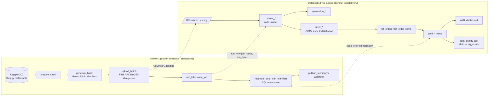

# food-delivery-databricks-lakehouse

[](https://github.com/rohit91jacob/food-delivery-databricks-lakehouse/actions/workflows/ci.yml)
[](LICENSE)


An end-to-end data platform for a Swiggy/Zomato-style **food-delivery** business, built on **Databricks Free
Edition** (Unity Catalog, Auto Loader, Lakeflow Declarative Pipelines with AUTO CDC/SCD2, Lakeflow Jobs, AI/BI
dashboard), all declared as a **Databricks Asset Bundle** and orchestrated by **Apache Airflow 3**.

A seeded, deterministic simulator turns a **CC0 Kaggle restaurant dataset** into a realistic daily feed: orders,
lifecycle events, rider dispatch and GPS pings, payments, refunds, ratings, promotions, surge and weather. It
writes a **ground-truth manifest** alongside the data, and the platform proves that every gold metric matches
it **exactly**, every day.

> **Status.** Everything below the Databricks line is built and verified locally and in CI. The bundle is
> schema-validated, but it has **not been deployed to a workspace yet**: that step is waiting on workspace
> credentials (see [Known limitations](#known-limitations)).

---

## Architecture



| Component | Where | What it does |
|---|---|---|
| Seed builder | `src/fooddelivery/seeding.py`, `generator/seed.py` | Downloads and normalises `abhijitdahatonde/swiggy-restuarant-dataset` (8,673 restaurants after cleaning), or synthesises a seed |
| Simulator | `src/fooddelivery/generator/` | 14 raw feeds plus a manifest per business date. Byte-for-byte reproducible; injects duplicates and corrupt rows on purpose |
| Landing sync | `src/fooddelivery/landing/uploader.py` | Files API upload to a UC volume. Skips unchanged files, prunes stale versions, commit-marker index |
| Lakeflow pipeline | `src/fooddelivery_pipeline/transformations/` | Bronze (Auto Loader) → silver (expectations, quarantine, AUTO CDC SCD1/SCD2) → gold (12 materialized views) |
| Shared logic | `src/fooddelivery/transforms/` | Schemas, rules and transformations, installed into the pipeline with `--editable ${workspace.file_path}` |
| DQ gate | `src/fooddelivery/quality/` | 13 checks (`fd-dq` job task → `dq_results`) plus independent Airflow reconciliation SQL |
| Bundle (IaC) | `databricks.yml`, `resources/*.yml` | Schema, volume, pipeline, job, dashboard; `dev`/`prod` targets |
| Orchestration | `airflow/` | DAG, image, docker-compose (LocalExecutor) |
| Offline emulator | `src/fooddelivery/local/` | Runs the **unchanged** pipeline files on local Spark with shims ([ADR 0004](docs/adr/0004-local-pipeline-emulator.md)) |

## Tech stack (pinned)

| Area | Version |
|---|---|
| Python | 3.12 (matches Databricks serverless environment 5) |
| Databricks CLI / bundles | 1.19.0 (checksum-verified in CI) |
| Lakeflow Declarative Pipelines | `from pyspark import pipelines as dp`, serverless, `channel: CURRENT` |
| Serverless jobs environment | `environment_version: "5"` |
| Apache Airflow | 3.3.2 + `apache-airflow-providers-databricks` 7.21.0 |
| databricks-sdk | 0.148.0 |
| kaggle | 2.2.4 (`KGAT_` access tokens) |
| Local Spark / Delta (tests, emulator) | pyspark 4.0.1 / delta-spark 4.0.1 (Java 17+) |
| Tooling | uv (lockfile `uv.lock`), ruff 0.16.10, pytest 9.1.1 |

## Data sources

| Source | Licence | Refresh |
|---|---|---|
| Kaggle [`abhijitdahatonde/swiggy-restuarant-dataset`](https://www.kaggle.com/datasets/abhijitdahatonde/swiggy-restuarant-dataset) (`swiggy.csv`): restaurant names, areas, cuisines, price-for-two, ratings, listed delivery time | **CC0-1.0** (public domain). Raw data is never committed | Downloaded once on first run and reused, so simulations stay reproducible. `fd seed --force` rebuilds it |
| Synthetic generator (this repo): customers, menus, orders, events, riders, shifts, GPS, payments, refunds, ratings, promotions, weather/traffic/surge | MIT (code) | One business date per day (Airflow `@daily` in Asia/Kolkata); any date can be regenerated |
| City-centre coordinates | Public knowledge | Static |

Why this dataset, and which ones were rejected: [ADR 0006](docs/adr/0006-kaggle-seed.md).

## Data model

Layers: landing (volume) → `bronze_*` → `quarantine_*` / `silver_*` → `fct_*` → `gold_*`, plus `dq_results`.
All are reconciled on **`business_date`** (order placement date, IST).

| Table | Grain / keys |
|---|---|
| `silver_restaurants`, `silver_menu_items` | SCD2 on `restaurant_id` / `item_id` (`__START_AT`, `__END_AT`) |
| `silver_orders`, `silver_order_items`, `silver_order_events`, … | SCD1 on natural keys (dedupe) |
| `fct_orders` | `order_id`, with point-in-time restaurant attributes and SLA durations |
| `gold_daily_kpis` | `business_date, city`; reconciles 1:1 with the manifest |
| `gold_delivery_sla_hourly`, `gold_restaurant_daily`, `gold_rider_daily`, `gold_customer_cohorts`, `gold_customer_ltv`, `gold_cancellations_daily`, `gold_refunds_daily`, `gold_menu_popularity_weekly`, `gold_surge_promo_daily` | see the data dictionary |

Full column-level detail is in [docs/data_dictionary.md](docs/data_dictionary.md), and metric definitions are in
[docs/metrics.md](docs/metrics.md).

## Quickstart

### Prerequisites
- [uv](https://docs.astral.sh/uv/), Python 3.12 and Java 17+ (Java is only needed for the Spark tests and `fd local-run`)
- A Kaggle API token in `~/.kaggle/access_token`. Without one, set `FD_SEED_SOURCE=synthetic`
- For deployment: a Databricks Free Edition workspace, a personal access token, and the Databricks CLI ≥ 1.19
- Optional: Docker for the compose deployment

### 1. Local run, no Databricks needed (verified locally)

```bash
uv sync --group dev --group spark --extra seed --extra databricks
export FD_DATA_DIR=$HOME/fd-work/data

uv run fd seed                                    # Kaggle download + normalisation
uv run fd generate --date 2026-09-01 --days 3     # landing files + manifest
uv run fd local-run                               # real pipeline sources on local Spark + the 13 DQ checks
```

`fd seed` prints the seed metadata, for example `"restaurants": 8673`, `"license": "CC0-1.0"`, and a sha256 that
is stable across runs. `fd generate` prints per-day file and row counts; with defaults, 2026-09-01 has
`"orders_placed": 2951`. `fd local-run` prints row counts for every dataset and the check results per date. The
3-day default run gave:

```text
bronze_orders 9540 -> silver_orders 9495 (+18 quarantined, 27 duplicates removed) -> fct_orders 9495
fct_order_items 17506, gold_daily_kpis 15 (5 cities x 3 days)
2026-09-01 / 02 / 03: all 13 checks ok, dq_failed_errors = 0
```

The same seed, config and date always produce identical files. Rerunning `fd generate` for a date rewrites the
same bytes.

### 2. Deploy to Databricks Free Edition (not yet run against a workspace; see the status note above)

```bash
export DATABRICKS_HOST=https://<workspace>.cloud.databricks.com
export DATABRICKS_TOKEN=<personal-access-token>
databricks bundle validate -t dev
databricks bundle deploy -t dev
uv run python scripts/bundle_env.py dev     # prints FD_SCHEMA / FD_DATABRICKS_JOB_NAME for the dev target
uv run fd upload --date 2026-09-01 --days 3
databricks bundle run fooddelivery_daily -t dev --params run_date=2026-09-01
```

### 3. Airflow

**Standalone, no Docker (verified locally):** this was run with the same settings as `make standalone`. The
API server, scheduler, triggerer and DAG processor all reported healthy, and the DAG registered with no import
errors. `prepare_seed` (the real Kaggle download) and `generate_batch` were also run with `airflow tasks test`.

```bash
uv sync --group dev --group airflow --extra seed --extra databricks
make standalone            # AIRFLOW__API__PORT=28880, DAGs from airflow/dags
```

**Docker Compose (verified in CI only: build, healthy services, DAG registered):**

```bash
cp airflow/.env.example airflow/.env       # set AIRFLOW_CONN_DATABRICKS_DEFAULT, FD_SCHEMA, FD_DATABRICKS_JOB_NAME
docker compose -f airflow/docker-compose.yaml up -d --build --wait
# UI: http://localhost:8080 (airflow / airflow)
```

A manually triggered run (or `airflow tasks test <dag> <task> <logical_date>`) processes the last *complete*
IST day before the logical date. For example, logical date `2026-09-02T00:00:00+05:30` processes business date
2026-09-01.

## Configuration

Every variable is in [`.env.example`](.env.example) (CLI and tests) and [`airflow/.env.example`](airflow/.env.example) (compose).

| Variable | Default | Purpose |
|---|---|---|
| `FD_SEED` | `42` | RNG seed (same seed + date ⇒ identical bytes) |
| `FD_START_DATE` | `2026-09-01` | Day 0 (full dimension snapshot) and DAG start |
| `FD_CITIES` | `Bangalore,Mumbai,Delhi,Hyderabad,Pune` | Any of the 9 seed cities |
| `FD_RESTAURANTS_PER_CITY` | `120` | Restaurants sampled from the seed per city |
| `FD_BASE_ORDERS_PER_CITY` | `600` | Daily orders before weekday/festival/weather/growth effects |
| `FD_INITIAL_CUSTOMERS_PER_CITY` | `4000` | Customer base on day 0 (grows about 0.45%/day) |
| `FD_RIDERS_PER_100_ORDERS` | `18` | Fleet size relative to demand |
| `FD_GPS_PING_SECONDS` | `120` | GPS ping interval while on an order |
| `FD_DUPLICATE_RATE` / `FD_INVALID_RATE` | `0.003` / `0.002` | Injected duplicates / corrupt orders |
| `FD_SEED_SOURCE` | `kaggle` | `kaggle` or `synthetic` |
| `FD_KAGGLE_TOKEN_FILE` | empty | File holding a `KGAT_` token (containers) |
| `FD_DATA_DIR` | `data` | Local landing zone, seed and downloads |
| `FD_CATALOG` / `FD_SCHEMA` / `FD_VOLUME` | `workspace` / `fooddelivery` / `landing` | UC target; dev schema is `dev_<user>_fooddelivery` |
| `FD_DATABRICKS_JOB_NAME` | `fooddelivery_daily` | dev: `[dev <user>] fooddelivery_daily` |
| `FD_SQL_WAREHOUSE_NAME` | `Serverless Starter Warehouse` | Warehouse for the Airflow reconciliation |
| `FD_DATABRICKS_CONN_ID` | `databricks_default` | Airflow connection id |
| `FD_ALERT_WEBHOOK_URL` | empty | Slack-compatible webhook for success/failure |
| `FD_LOG_LEVEL` / `FD_LOG_FORMAT` | `INFO` / `json` | Structured logging |
| `FD_SPARK_MASTER` / `FD_SPARK_DRIVER_MEMORY` / `FD_SPARK_JARS` | `local[4]` / `2g` / empty | Local Spark; `FD_SPARK_JARS` takes offline Delta jars |

## Testing & CI

```bash
uv run ruff check . && uv run ruff format --check .
uv run pytest -m "not spark and not airflow"     # 26 tests: generator, seed, config, uploader, SQL, bundle schema
uv run pytest -m spark                            # 10 tests: SCD semantics + pipeline end-to-end (emulator + DQ)
AIRFLOW__CORE__LOAD_EXAMPLES=false uv run pytest -m airflow   # 3 tests: DAG integrity
```

All of these ran locally (WSL, Java 21).

| Workflow / job | What it checks |
|---|---|
| `ci.yml` / lint | ruff lint + format |
| `ci.yml` / unit | Unit tests, plus every bundle YAML validated against `databricks bundle schema` from the pinned CLI |
| `ci.yml` / spark | Java 17: SCD1/SCD2 semantics; the real pipeline sources emulated end to end; every error-severity DQ check per day; exact dedupe/quarantine counts; SCD2 point-in-time pricing; the Airflow reconciliation SQL passing, then catching a 1-paisa tamper; idempotent rerun |
| `ci.yml` / airflow | DagBag import, task graph, retries, `depends_on_past`, deferrable trigger |
| `ci.yml` / compose | `docker compose config`, image build, `up --wait` (all services healthy), DAG registered without import errors |
| `deploy.yml` | `bundle validate` + `deploy` (dev on PRs, prod on `main`). **Skipped cleanly until `DATABRICKS_HOST`/`DATABRICKS_TOKEN` repo secrets exist** |

Dependabot covers Actions, uv and Docker. pre-commit runs ruff and basic hygiene hooks.

## Operations

- **Scheduling:** Airflow `food_delivery_daily` at 00:00 IST, `catchup=True`, `max_active_runs=1` (Free Edition
  allows one active pipeline update). The bundle job's own schedule ships paused.
- **Backfill/reprocessing:** `airflow backfill create --dag-id food_delivery_daily --from-date … --to-date …`.
  Every step is idempotent per date ([ADR 0002](docs/adr/0002-idempotency.md)). After a generator change, bump
  `GENERATOR_VERSION` and full-refresh the pipeline.
- **Data quality:** expectations (warn/drop/fail plus quarantine tables), the `fd-dq` gate writing `dq_results`,
  and independent reconciliation from Airflow ([ADR 0005](docs/adr/0005-layered-data-quality.md)).
- **Monitoring/alerts:** pipeline and job failure emails to the deployer, the Airflow `on_failure_callback`
  webhook, `dq_results` history, and the AI/BI dashboard.
- Runbook (backfills, DQ triage, quota exhaustion, credential rotation, dev reset): [docs/runbook.md](docs/runbook.md).

## Project structure

```text
.
├── databricks.yml                 # bundle: variables, dev/prod targets
├── resources/                     # storage.yml, pipeline.yml, job.yml, dashboard.yml
├── dashboards/food_delivery_ops.lvdash.json
├── src/
│   ├── fooddelivery/
│   │   ├── generator/             # world model, simulator, writer, seed normalisation
│   │   ├── transforms/            # schemas, silver specs/rules, gold marts (shared with the pipeline)
│   │   ├── quality/               # DQ check catalog, fd-dq runner, Airflow reconciliation SQL
│   │   ├── landing/uploader.py    # Files API sync
│   │   ├── local/                 # pipeline emulator + local AUTO CDC (SCD1/SCD2)
│   │   ├── seeding.py, config.py, logs.py, cli.py
│   └── fooddelivery_pipeline/transformations/   # bronze_ingest.py, silver_conform.py, gold_marts.py
├── airflow/                       # dags/, Dockerfile, docker-compose.yaml, .env.example
├── tests/                         # unit/, spark/, airflow/
├── docs/                          # data_dictionary.md, metrics.md, runbook.md, adr/
├── scripts/bundle_env.py
├── .github/                       # workflows/ci.yml, workflows/deploy.yml, dependabot.yml
├── Makefile, pyproject.toml, uv.lock, .env.example, .pre-commit-config.yaml
```

## Design decisions & trade-offs

- **Generate outside, ingest inside** ([ADR 0001](docs/adr/0001-free-edition-constraints.md)): serverless has
  restricted egress, so Airflow pushes files through the Files API and the workspace never calls the internet.
- **One schema, prefixed layers.** Simpler grants and bundle management on a single-workspace Free Edition.
  Dev and prod are separated by the bundle's dev-mode schema prefix.
- **AUTO CDC everywhere in silver, SCD2 only where history is consumed**
  ([ADR 0003](docs/adr/0003-auto-cdc-and-scd2.md)). Commission and line prices are joined point-in-time.
- **Exact reconciliation, not tolerances.** Money is DECIMAL end to end, and lateness is judged on whole-second
  timestamps on both sides.
- **Business-date partitioning.** Events after midnight stay with their order's date, so dates are self-contained
  and replayable.
- **Emulator instead of mocks** ([ADR 0004](docs/adr/0004-local-pipeline-emulator.md)). The CI tests execute the
  same pipeline files that Databricks runs.

## Known limitations

- **Not yet deployed to Databricks.** The bundle passes CLI-schema validation and the pipeline sources pass the
  emulator, but `bundle deploy` and a live pipeline/job/dashboard run have not been executed. They need the
  workspace host + PAT. The Databricks-only behaviours (Auto Loader incremental state, AUTO CDC on real streams,
  MV incremental refresh, the `.lvdash.json` rendering) are therefore unverified.
- Docker Compose has only been verified in GitHub Actions (no Docker on the development machine).
- The generator is a model, not reality. Behavioural parameters (demand curves, rain by month, prep and travel
  speeds) are documented constants, not fitted.
- `FD_START_DATE` must be generated first: day 0 carries the full dimension snapshot, and later dates carry CDC
  changes only.

## Roadmap

- Deploy and run the full DAG against the Free Edition workspace; set the CI deploy secrets.
- File-arrival trigger on the volume instead of Airflow-triggered runs (paid tiers).
- Streaming file drops (intraday micro-batches) for near-real-time SLA tiles.
- Unity Catalog metric views / Genie space over `gold_*`.
- Lakehouse monitoring on `gold_daily_kpis` for drift alerts.

## License

Code: [MIT](LICENSE). Seed data: Kaggle `abhijitdahatonde/swiggy-restuarant-dataset`, CC0-1.0, downloaded at
runtime and never redistributed in this repo.
